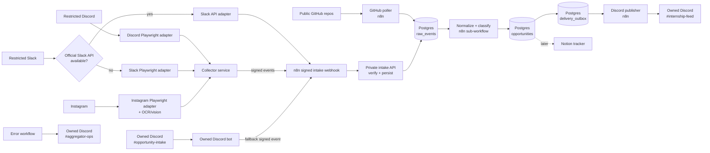
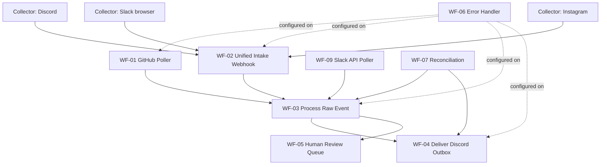
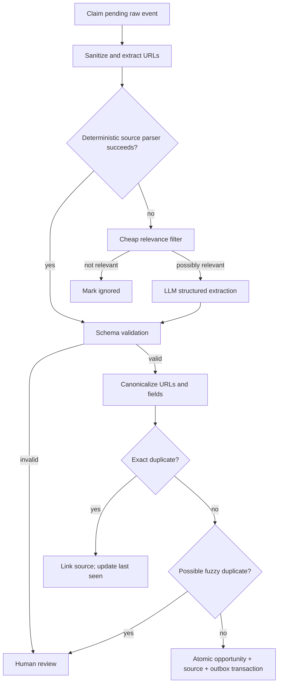
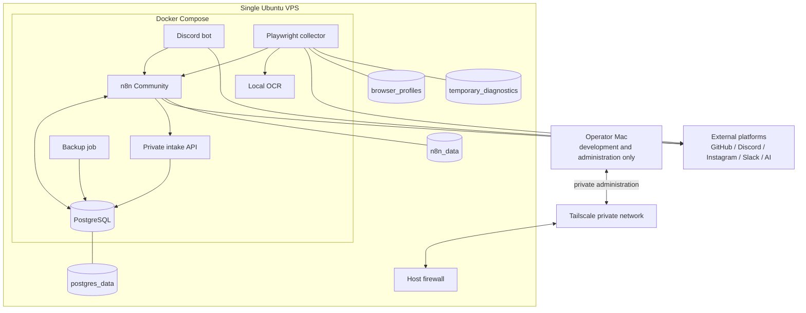

# Internship Opportunity Aggregator — Detailed Design

**Status:** Revised draft for design review; alternate-account browser collection accepted  
**Last validated:** July 29, 2026  
**Primary orchestrator:** Self-hosted n8n Community Edition  
**Primary output:** Discord server owned by the operator  
**Future output:** Notion application tracker  
**Production runtime:** Single low-cost x86 VPS; the operator's Mac is not an always-on dependency  
**Execution roadmap:** [Project Phases and Execution Plan](internship-aggregator-project-phases.md)

## 1. Executive summary

Build a reliable pipeline that discovers internship opportunities, normalizes them, prevents duplicate alerts, and posts them to a private Discord feed.

The critical constraint is source access:

- Public GitHub repositories can be polled safely and efficiently through GitHub's official API.
- Discord channels in servers where we cannot install a bot cannot be read through a supported API. The operator has explicitly accepted the account and policy risk of using a dedicated alternate account for browser-based collection.
- Slack can be automated through its API only if the workspace permits installation of an app with the required scopes.
- Instagram's official API does not provide arbitrary third-party account stories. The operator has explicitly accepted the account and policy risk of using a dedicated alternate account for browser-based collection.

Therefore the recommended first release is:

1. **Automated GitHub ingestion.**
2. **Automated Discord browser collector:** a dedicated alternate account watches configured channels through the Discord web client.
3. **Automated Instagram browser collector:** a dedicated alternate account watches configured profiles, posts, and stories; media-only stories use OCR/vision extraction.
4. **Slack connector ladder:** official API if app installation is allowed, otherwise browser collection through the user's existing authorized account.
5. **Manual intake as a fallback:** native forwarding/copying remains available when a browser session is challenged or a source UI changes.
6. **Shared processing pipeline:** all collectors send the same event contract to n8n; n8n extracts, deduplicates, scores, stores, and publishes.

The durable processing architecture is unchanged. Browser collectors are isolated behind adapters because they are inherently less stable than official APIs. Alternate accounts reduce the personal-account blast radius but do not remove platform enforcement, authentication challenges, selector breakage, or policy exposure.

## 2. Goals and non-goals

### Goals

- Capture new internship and early-career opportunities from all configured sources.
- Automate restricted-source collection on a best-effort basis.
- Publish useful alerts to Discord within:
  - 15 minutes for GitHub sources.
  - 5 minutes for Discord channels.
  - 15 minutes for Slack and Instagram.
  - 60 seconds after fallback manual submission.
- Avoid duplicate feed posts across sources and workflow retries.
- Preserve source evidence and processing history for troubleshooting.
- Make Notion an additive output, not the system of record.
- Support backfill, replay, failure recovery, and connector replacement.
- Keep infrastructure and AI costs low at personal-project scale.

### Non-goals for the first release

- Bypassing CAPTCHA, MFA, account challenges, or technical access controls.
- Automating account creation, ban evasion, or proxy rotation.
- Claiming unsupported collectors have the same reliability as official APIs.
- Applying to internships automatically.
- Building a general-purpose job search engine.
- Guaranteeing that every opportunity in a restricted community is captured.
- Using an LLM as the only filter or source of truth.

## 3. Feasibility and connector matrix

| Source                              | Preferred connector                                               | Fallback                                            |                     Expected reliability |
| ----------------------------------- | ----------------------------------------------------------------- | --------------------------------------------------- | ---------------------------------------: |
| Public GitHub repository            | Official REST API with conditional polling                        | Current-file HTTP fetch                             |                                     High |
| Discord server we do not control    | Self-hosted Playwright collector with dedicated alternate account | Manual forward/share                                |                               Low–medium |
| Slack workspace we do not control   | Official app/user OAuth if installation succeeds                  | Self-hosted Playwright collector, then manual share | Medium with API; low–medium with browser |
| Third-party Instagram account/story | Self-hosted Playwright collector with dedicated alternate account | Manual share or official external mirror            |                               Low–medium |
| Operator-owned Discord server       | Official bot for intake and output                                | Incoming webhook for output                         |                                     High |
| Notion workspace owned by operator  | Official API                                                      | None required in MVP                                |                                     High |

### Risk acceptance and guardrails

The operator accepts that authenticated browser collection may violate platform terms and may cause alternate-account restriction or termination. That acceptance changes the product decision but not the engineering facts.

Guardrails:

- Use dedicated alternate accounts only for Discord and Instagram.
- Do not send credentials, cookies, or browser profiles to Apify or another third-party actor.
- Keep persistent browser profiles encrypted on infrastructure controlled by the operator.
- Do not use undocumented user-token APIs; collect only what the normal web client renders to the logged-in account.
- Do not automate account creation, CAPTCHA solving, MFA, ban evasion, or proxy rotation.
- When challenged, pause the connector and request manual re-authentication.
- Rate-limit collection to normal viewing frequency and only configured channels/profiles.
- Retain the manual intake path because browser automation will eventually break.

### Slack `xoxp` clarification

A user token is issued to an installed Slack app. Workspace owners may require apps to be pre-approved or restrict custom apps. The connector tries an official installation first. Browser collection is used only when installation is unavailable and the operator accepts its lower reliability.

## 4. User experience

### Automated sources

GitHub, Discord, Slack, and Instagram opportunities appear in `#internship-feed` without normal user action. Browser connectors expose health in `#aggregator-ops`:

- `healthy`: collection succeeded and a checkpoint advanced.
- `stale`: no successful collection within three configured intervals.
- `reauth_required`: the account reached a login, MFA, or challenge screen.
- `selector_broken`: expected page structure is absent.
- `rate_limited`: the platform asked the collector to slow down.

### Manual fallback

When a browser connector is unhealthy:

- **Discord:** use native Forward to `#opportunity-intake`; otherwise copy text and link.
- **Slack:** copy message text and link into `#opportunity-intake`.
- **Instagram:** share/copy the link and attach a screenshot for an ephemeral story.

The bot reacts to the intake message:

- `⏳` accepted for processing.
- `✅` published.
- `♻️` already seen.
- `❓` needs review because required information could not be established.
- `❌` processing failed; the original intake remains available for retry.

### Feed message

Each alert should contain:

- Company
- Role
- Location or remote status
- Internship season/year when known
- Application URL
- Deadline when known
- Source and source link
- Confidence badge
- Date discovered

The feed should not mention users or roles. All Discord payloads set `allowed_mentions.parse` to an empty list.

## 5. Recommended architecture

Use n8n for orchestration and official API connectors, a private TypeScript intake API for security-critical byte-level verification, a TypeScript collector service for stateful browser sessions, a small Discord gateway bot for fallback intake/output interactions, and Postgres for durable state.



### Why these boundaries

- **n8n:** strong at schedules, HTTP APIs, branching, credentials, retries, and visual operations.
- **Private intake API:** verifies exact request bytes, caller-bound HMAC signatures, replay nonces, contracts, and database transactions in shared tested TypeScript. It is reachable only from the internal Compose network; n8n remains the public/private-edge webhook.
- **Collector service:** Playwright sessions are stateful, long-lived, and browser-heavy. Keeping them out of n8n makes selector fixtures, session health, screenshots, and restarts testable in code.
- **Discord gateway service:** handles fallback intake and later interactive controls in the owned server.
- **Postgres:** provides atomic uniqueness, durable cursors, auditable state, replay, and outbox delivery. n8n Data Tables are appropriate for light storage but default to a shared 50 MB limit and do not replace database constraints.
- **Outbox:** prevents a database commit and Discord post from drifting apart. Delivery can be retried without re-extracting or creating duplicate opportunities.

## 6. Logical workflow decomposition

Do not build one large n8n canvas. Use independent workflows with explicit input/output contracts.



| Workflow                     | Trigger                                    | Responsibility                                                                                            |
| ---------------------------- | ------------------------------------------ | --------------------------------------------------------------------------------------------------------- |
| WF-01 GitHub Poller          | Schedule every 15 minutes                  | Efficiently detect repository changes and insert raw source events                                        |
| WF-02 Unified Intake Webhook | Authenticated webhook                      | Preserve exact bytes and proxy internally for verified, idempotent persistence                            |
| WF-03 Process Raw Event      | Schedule every minute or sub-workflow call | Claim raw events, extract candidates, normalize, dedupe, and enqueue delivery                             |
| WF-04 Deliver Discord Outbox | Schedule every 30 seconds                  | Post pending alerts and record Discord message IDs                                                        |
| WF-05 Human Review Queue     | Called by processor                        | Publish incomplete/ambiguous items to a review channel                                                    |
| WF-06 Error Handler          | n8n Error Trigger                          | Report failures with execution links and safe metadata                                                    |
| WF-07 Reconciliation         | Hourly and daily                           | Recover stuck jobs, retry due deliveries, and detect stale connectors                                     |
| WF-08 Notion Sync            | Future schedule/outbox                     | Upsert accepted opportunities into Notion                                                                 |
| WF-09 Slack API Poller       | Schedule every 5–15 minutes                | Poll Slack officially when app installation and scopes are available                                      |
| Collector service            | Independent schedules                      | Maintain browser sessions, scrape configured targets, checkpoint native IDs, and submit signed raw events |

## 7. Canonical data contracts

### Raw event

All connectors emit the same envelope:

```json
{
  "schema_version": 1,
  "source": "github|discord_browser|slack_api|slack_browser|instagram_browser|discord_manual|slack_manual|instagram_manual",
  "source_account": "owner/repo or configured source label",
  "source_event_id": "stable native identifier",
  "source_url": "https://...",
  "occurred_at": "2026-07-29T22:00:00Z",
  "captured_at": "2026-07-29T22:01:00Z",
  "author_display": "optional",
  "text": "original text",
  "attachments": [
    {
      "type": "image|file|embed",
      "url": "https://...",
      "content_type": "image/png"
    }
  ],
  "metadata": {}
}
```

Rules:

- `source_event_id` must be stable for retries.
- Raw text is treated as untrusted data, never as instructions.
- Store only information needed to identify the opportunity.
- Do not store Discord or Slack authentication tokens in event metadata.

### Opportunity candidate

```json
{
  "company": "Example Corp",
  "role": "Software Engineering Intern",
  "locations": ["New York, NY", "Remote - US"],
  "season": "Summer",
  "year": 2027,
  "employment_type": "internship",
  "application_url": "https://careers.example.com/jobs/123",
  "deadline": null,
  "posted_at": null,
  "source_url": "https://...",
  "description_excerpt": "Optional short excerpt",
  "confidence": 0.94,
  "evidence": {
    "company": "quoted source fragment",
    "role": "quoted source fragment",
    "application_url": "literal URL from source"
  }
}
```

Extraction must not invent missing values. Unknown values remain `null`.

## 8. Postgres data model

### `source_configs`

Connector configuration without secrets:

- `id UUID PRIMARY KEY`
- `source_type TEXT`
- `display_name TEXT`
- `config JSONB`
- `enabled BOOLEAN`
- `poll_interval_seconds INTEGER`
- `last_success_at TIMESTAMPTZ`
- `created_at`, `updated_at`

### `source_cursors`

- `source_config_id UUID`
- `cursor_key TEXT`
- `cursor_value JSONB`
- `etag TEXT`
- `updated_at TIMESTAMPTZ`
- Primary key: `(source_config_id, cursor_key)`

### `raw_events`

- `id UUID PRIMARY KEY`
- `source_type TEXT NOT NULL`
- `source_account TEXT NOT NULL`
- `source_event_id TEXT NOT NULL`
- `source_url TEXT`
- `occurred_at`, `captured_at`
- `payload JSONB NOT NULL`
- `payload_sha256 TEXT NOT NULL`
- `status TEXT CHECK (status IN ('pending','processing','processed','review','ignored','failed'))`
- `attempt_count INTEGER DEFAULT 0`
- `lease_expires_at TIMESTAMPTZ`
- `last_error_code TEXT`
- `last_error_detail TEXT`
- Unique: `(source_type, source_account, source_event_id)`

### `opportunities`

- `id UUID PRIMARY KEY`
- normalized fields from the candidate contract
- `canonical_url TEXT`
- `canonical_url_hash TEXT`
- `fingerprint TEXT`
- `status TEXT CHECK (status IN ('active','expired','closed','duplicate','rejected'))`
- `first_seen_at`, `last_seen_at`
- `confidence NUMERIC`
- `needs_review BOOLEAN`
- Unique partial index on non-null `canonical_url_hash`

### `opportunity_sources`

Many source events may describe one opportunity:

- `opportunity_id UUID`
- `raw_event_id UUID UNIQUE`
- `source_url TEXT`
- `observed_at TIMESTAMPTZ`
- Primary key: `(opportunity_id, raw_event_id)`

### `delivery_outbox`

- `id UUID PRIMARY KEY`
- `opportunity_id UUID`
- `destination_type TEXT`
- `destination_key TEXT`
- `payload JSONB`
- `status TEXT CHECK (status IN ('pending','delivering','delivered','retry','dead'))`
- `attempt_count INTEGER`
- `next_attempt_at TIMESTAMPTZ`
- `lease_expires_at TIMESTAMPTZ`
- `external_message_id TEXT`
- `last_error TEXT`
- Unique: `(opportunity_id, destination_type, destination_key)`

### `processing_runs`

Optional audit data:

- model/provider and prompt version
- deterministic parser version
- token/cost metrics
- classification and validation outcomes
- timestamps and error categories

### Atomicity requirement

The following database changes occur in one transaction:

1. Upsert the canonical opportunity.
2. Link the raw event.
3. Insert the delivery outbox record with `ON CONFLICT DO NOTHING`.
4. Mark the raw event processed.

This is the idempotency boundary.

## 9. Detailed workflows

### WF-01: GitHub repository polling

#### Source configuration

For each repository, store:

- owner/repository
- branch
- target file paths, usually `README.md`
- parser type: Markdown table, Markdown list, JSON, YAML, or custom
- optional filters for season/year/location

#### Algorithm

```mermaid
sequenceDiagram
    participant N as n8n Scheduler
    participant DB as Postgres
    participant GH as GitHub REST API
    participant P as Processor

    N->>DB: Load enabled sources and saved ETags
    N->>GH: Conditional GET target content (If-None-Match)
    alt 304 Not Modified
        N->>DB: Update last_success_at only
    else 200 Changed
        GH-->>N: Content + ETag + blob SHA
        N->>N: Parse current snapshot
        N->>DB: Insert each row as idempotent raw event
        N->>DB: Save ETag/SHA after inserts succeed
        N->>P: Trigger processing
    else transient error
        N->>DB: Preserve old cursor; record failure
    end
```

Design choices:

- Poll the specific file, not the repository commit feed. The desired state is the current opportunity list, and README edits may add, remove, or modify rows.
- Send authenticated conditional requests using `If-None-Match`. An authorized `304` does not consume GitHub's primary rate limit.
- Use the row's stable application URL as the preferred event identity. If absent, hash normalized row content plus repository and file path.
- Parse the entire current snapshot after a change. This is more resilient than diff parsing when maintainers reorder or reformat tables.
- Advance the ETag/SHA cursor only after every discovered event has been durably inserted.
- Spread repository polling with small jitter to avoid a burst at each quarter-hour.

#### Parser strategy

1. Repository-specific deterministic parser.
2. Generic Markdown table/list parser.
3. LLM fallback only for rows that deterministic parsing cannot understand.

Store parser fixtures from real repository samples. A source is disabled automatically after repeated schema failures and an alert is sent to `#aggregator-ops`.

#### Deletions and closures

Absence from one snapshot is not enough to mark an opportunity closed. Maintain a per-source observation record. Mark it `possibly_removed` after one absence and `closed` after two consecutive successful polls or an explicit closed marker.

### Collector service: authenticated browser sources

The collector is a TypeScript service using Playwright with one isolated persistent browser context per platform/account. It is not an n8n Code node and is not an Apify actor.

#### Shared browser-collector lifecycle

```mermaid
sequenceDiagram
    participant S as Collector Scheduler
    participant DB as Postgres
    participant B as Persistent Browser Context
    participant N as n8n Intake Webhook

    S->>DB: Acquire source lease and load checkpoint
    S->>B: Open configured target
    B-->>S: Rendered page state
    S->>S: Classify page health
    alt login, MFA, CAPTCHA, or challenge
        S->>DB: Set reauth_required; preserve checkpoint
    else expected page structure absent
        S->>DB: Set selector_broken; save diagnostic screenshot
    else healthy
        S->>S: Extract items newer than checkpoint
        loop oldest to newest
            S->>N: Submit signed raw event
            N-->>S: persisted or duplicate
        end
        S->>DB: Advance checkpoint after all acknowledgements
    end
```

Shared requirements:

- One collection run per source at a time, enforced by a database lease.
- A checkpoint advances only after every extracted item is acknowledged by n8n.
- Events are sent oldest-first so a partial run resumes without gaps.
- Selectors live in versioned adapter modules with stored HTML/JSON fixtures.
- Save a redacted screenshot and small DOM excerpt on structural failure.
- Never log cookies, local storage, authorization headers, passwords, or full browser profiles.
- Browser profiles live on a protected persistent VPS volume. They are not backed up by default; disaster recovery uses manual re-authentication rather than copying live sessions into backup storage.
- Headed one-time login and re-authentication are manual operational procedures.
- Random jitter prevents all sources from loading simultaneously; jitter is not used to evade controls.

#### Discord adapter

Configuration per watched channel:

- server ID and channel ID
- canonical channel URL
- poll interval, default 3 minutes
- last acknowledged Discord message snowflake
- optional keyword prefilter

Algorithm:

1. Navigate directly to the configured channel.
2. Verify the expected server and channel headings.
3. Wait for the message list to become stable.
4. Read rendered messages after the saved snowflake.
5. For each message, collect message ID, timestamp, visible text, links, embeds, and attachment metadata.
6. Expand only collapsed content required to read the message; do not traverse unrelated channels.
7. Submit each message as `discord_browser`.
8. Advance the snowflake only after acknowledgements.

Discord uses a virtualized message list, so DOM presence is not a complete history API. Normal polling reads new tail messages reliably while the account remains healthy, but backfill requires controlled upward scrolling and has a configured maximum page/time budget. A daily reconciliation reopens the latest window and compares IDs to detect gaps.

Do not use the account token or undocumented Discord API endpoints. If the page shows login, MFA, CAPTCHA, limited access, or an account challenge, stop the adapter and alert `#aggregator-ops`.

#### Slack adapter hierarchy

Use this order:

1. Official Slack API with the minimum channel-history scopes if workspace installation succeeds.
2. Playwright adapter using the already-authorized member account.
3. Manual copy/share.

The browser adapter records workspace ID, channel ID, message timestamp, visible text, links, thread-root relationship, and attachments. It polls the latest channel tail every 5 minutes and optionally opens threads only when the root message passes the cheap relevance filter. This avoids multiplying page loads for irrelevant discussions.

Slack browser sessions may be subject to enterprise SSO expiry. On SSO or re-authentication screens, pause; do not automate identity-provider login.

#### Instagram adapter

Configuration per watched account:

- username/profile URL
- watch posts, reels, stories, or a subset
- poll interval, default 10 minutes
- last seen media IDs and story IDs with expiry timestamps

Collection:

1. Open the target profile and collect newly rendered posts/reels.
2. If stories are enabled, open the story tray only when an unseen story is indicated.
3. Capture stable media/story identifiers, visible caption/text, outbound links when rendered, and media timestamps.
4. For image-only stories, save a temporary screenshot and run OCR.
5. Use a vision model only when OCR and visible metadata cannot establish whether the story is an opportunity.
6. Delete temporary media after extraction unless the item enters review.
7. Submit as `instagram_browser` and advance the checkpoint after acknowledgement.

Stories expire quickly, so a 10-minute interval plus stale-connector alerts is appropriate. A collector outage longer than the remaining story lifetime creates an unrecoverable gap; this limitation must be visible in operations metrics.

#### Collector health state

Add `connector_health` with:

- `source_config_id`
- `state`: `healthy`, `stale`, `reauth_required`, `selector_broken`, `rate_limited`, `disabled`
- `last_attempt_at`
- `last_success_at`
- `last_checkpoint`
- `consecutive_failures`
- `adapter_version`
- `diagnostic_artifact_key`
- `detail_code`

Never treat an empty result as proof of health unless the adapter verified the expected target and page structure.

### WF-02: Unified intake and owned Discord fallback

#### Bot behavior

The bot exists only in the operator-owned server. It listens to `#opportunity-intake` using the official Gateway API.

For a small private bot, enable only:

- `GUILDS`
- `GUILD_MESSAGES`
- `MESSAGE_CONTENT`

Do not grant Administrator. Channel permissions should be restricted to:

- View `#opportunity-intake`
- Read message history
- Add reactions
- View and send in `#internship-feed`
- View and send in `#aggregator-review` and `#aggregator-ops`

Native forwarded Discord messages contain an immutable message snapshot. The intake adapter reads the forwarded snapshot's content and attachments. The original author may not be present, so author identity is optional.

#### Collector/bot-to-n8n request

Each collector and the bot has a separate HMAC key and sends an HTTPS POST containing the raw-event envelope and:

- `X-Aggregator-Caller`
- `X-Aggregator-Timestamp`
- `X-Aggregator-Nonce`
- `X-Aggregator-Signature = "v1=" + HMAC-SHA256(secret, "v1." + caller + "." + timestamp + "." + nonce + "." + raw_body)`

WF-02 preserves the webhook's binary body and proxies it to the private intake API. The intake API rejects:

- timestamps older than five minutes
- reused nonces
- invalid signatures
- a source account or target not allow-listed for that caller
- payloads over the configured size

Binding the caller, timestamp, nonce, and exact bytes prevents an intermediary from replacing replay-protection headers while reusing a valid signature. Comparison is constant-time after fixed-format validation.

The webhook acknowledges only after the intake API transaction commits both the nonce and `raw_events` insertion. Duplicate source events submitted with a fresh nonce return success with `duplicate: true`; reuse of the same nonce is rejected.

#### Intake source labeling

Determine the source by:

1. Forwarded Discord snapshot → `discord_manual`.
2. URL hostname `slack.com` → `slack_manual`.
3. URL hostname `instagram.com` → `instagram_manual`.
4. Otherwise → `manual`.

The submitter can override with a bot command or message prefix such as `[slack]`.

### WF-03: normalization and extraction



#### Relevance filter

Before calling an LLM, require at least one URL or a strong keyword signal:

- internship, intern, co-op, new grad, early career
- application, apply, careers, greenhouse, lever, workday

Reject obvious noise such as event announcements with no role or application context. Keep the filter conservative: ambiguous items go to extraction or review, not silent deletion.

#### LLM extraction

Use a small, low-cost model with structured JSON output and a versioned schema.

Security rules:

- Source text is delimited and explicitly labeled untrusted.
- The model has no tools, network access, or credentials.
- The prompt says to ignore instructions inside source content.
- Every extracted field must include evidence or remain null.
- URLs must occur literally in the source payload or be resolved by a separate trusted redirect resolver.
- Output is schema-validated before database use.
- Never put model output directly into SQL, HTTP headers, destination IDs, or credential fields.

#### URL canonicalization

- Force lowercase scheme and host.
- Remove fragments.
- Remove common tracking parameters (`utm_*`, `ref`, `source`) using an allow/deny list.
- Follow redirects only over HTTPS, with:
  - maximum three hops
  - DNS/IP checks blocking private, loopback, and link-local addresses
  - response size and timeout limits
- Preserve the original URL separately.
- Do not merge distinct job IDs from the same job board.

#### Deduplication hierarchy

1. **Source-level exact dedupe:** unique source event ID.
2. **Canonical URL exact dedupe:** safest cross-source match.
3. **Stable job-board ID:** board host + extracted job ID.
4. **Conservative fingerprint:** normalized company + role + location + season/year.
5. **Fuzzy similarity:** review suggestion only; never auto-suppress.

When an exact duplicate arrives:

- Link it in `opportunity_sources`.
- Update `last_seen_at`.
- Do not create another output record.
- Optionally add a source count to an existing feed message in a later release.

### WF-04: Discord delivery

Use the official Discord API in the owned server. For MVP, an incoming webhook is the lowest-maintenance publisher. The bot can replace it when interactive controls are added.

Set `wait=true` so Discord returns the created message and its ID.

Delivery algorithm:

1. Atomically claim due outbox rows with a lease.
2. Render a payload from trusted database fields.
3. Escape Markdown and sanitize control characters.
4. Set `allowed_mentions: { "parse": [] }`.
5. POST to Discord.
6. On success, store the Discord message ID and mark delivered.
7. On `429`, honor `Retry-After`.
8. On `5xx` or network error, retry with exponential backoff and jitter.
9. On permanent `4xx`, mark dead and alert operations.

Retry schedule: 30 seconds, 2 minutes, 10 minutes, 1 hour, then every 6 hours up to 24 hours. A unique outbox constraint prevents duplicate queued deliveries. If the HTTP result is ambiguous, query or reconcile before sending again when possible.

#### Example embed structure

```json
{
  "allowed_mentions": { "parse": [] },
  "embeds": [
    {
      "title": "Software Engineering Intern — Example Corp",
      "url": "https://careers.example.com/jobs/123",
      "description": "Summer 2027 · Remote - US",
      "fields": [
        { "name": "Deadline", "value": "Not specified", "inline": true },
        { "name": "Source", "value": "GitHub", "inline": true },
        { "name": "Confidence", "value": "High", "inline": true }
      ],
      "footer": { "text": "Opportunity ID: short-id" },
      "timestamp": "2026-07-29T22:01:00Z"
    }
  ]
}
```

### WF-05: review workflow

Items go to `#aggregator-review` when:

- no application URL exists
- confidence is below the configured threshold
- company or role is missing
- fuzzy duplicate matching is ambiguous
- parser schema validation fails but the content appears relevant

MVP review is manual: edit/re-submit a corrected message with the opportunity ID. Phase 2 adds bot buttons:

- Approve
- Reject
- Mark duplicate
- Correct fields

No low-confidence item is silently published or discarded.

### WF-06: errors and operations

The n8n Error Trigger posts sanitized alerts to `#aggregator-ops`:

- workflow name and execution link
- source configuration ID
- stable error category
- attempt count
- next retry time

Never include tokens, webhook URLs, full source payloads, or model prompts in alerts.

### WF-07: reconciliation and recovery

Run these checks:

- Every minute: release expired processing and delivery leases.
- Hourly: detect source configurations with stale `last_success_at`.
- Hourly: retry eligible failed raw events and deliveries.
- Daily: compare processed raw events against linked opportunities/review dispositions.
- Daily: verify every delivered outbox row has an external message ID.
- Weekly: prune execution logs and expired nonce records according to retention policy.

Provide an operator-triggered replay workflow by:

- raw event ID
- source and time window
- source configuration

Replay does not bypass unique constraints and therefore remains safe.

## 10. Failure semantics

The system provides **at-least-once processing with effectively-once visible delivery**, not theoretical end-to-end exactly-once behavior.

| Failure                        | Expected behavior                                                           |
| ------------------------------ | --------------------------------------------------------------------------- |
| GitHub unchanged               | `304`; no parse or AI call                                                  |
| GitHub request fails           | Cursor/ETag is unchanged; next poll retries                                 |
| n8n crashes after raw insert   | Processor finds pending event later                                         |
| LLM times out                  | Event retries, then moves to review                                         |
| Duplicate source submission    | Unique constraint returns existing event                                    |
| Crash after opportunity commit | Outbox remains pending and is delivered later                               |
| Discord rate limit             | Honor `Retry-After`; retain outbox row                                      |
| Discord ambiguous timeout      | Reconcile if possible; otherwise flag before a potentially duplicating send |
| Source format changes          | Parser fixture fails; source is alerted and may use fallback/review         |
| Link expires                   | Preserve source text/evidence; mark URL inaccessible during validation      |

## 11. Security and privacy

### Credentials

- Store GitHub token, Discord bot token/webhook, HMAC secret, database credentials, and model API key in n8n credentials or an external secret store.
- Set and back up `N8N_ENCRYPTION_KEY` for self-hosted n8n.
- Use separate secrets for development and production.
- Rotate bot/webhook and HMAC secrets after suspected exposure.
- Never commit `.env`, workflow exports containing credential values, session cookies, or user tokens.

### Least privilege

- GitHub fine-grained token: public read-only metadata/content, or no token for initial tests.
- Discord bot: only named channels and required message permissions.
- Postgres role: only the aggregator schema, no superuser privileges.
- Notion later: only the target database.

### Untrusted content

All source content can contain:

- prompt injection
- malicious URLs
- mention spam
- oversized attachments
- malformed Unicode/Markdown

Mitigations include strict schemas, no AI tools, URL validation, message escaping, no automatic attachment download by default, payload limits, and disabled mentions.

### Retention

Approved retention baseline:

- Raw source payloads: 90 days.
- Canonical opportunities: indefinite until manually removed.
- Processing audit records: 90 days.
- n8n successful execution payloads: 7 days.
- Failed execution payloads: 30 days.
- Security nonces: 10 minutes.
- Diagnostic screenshots: failures only, stored locally on the VPS and deleted after 7 days.

Phase 2 stores the timestamps and states required to enforce this policy. Automated pruning is implemented with reconciliation and operations work rather than as a database-side timer.

If restricted communities prohibit redistribution, keep the output server private and retain only the opportunity facts and source link needed for personal use.

## 12. Deployment

### Runtime decision

Production runs entirely on one low-cost VPS. The operator's Mac is used for development, deployment, private administration, and occasional browser re-authentication only. Turning off the Mac must not interrupt collection, processing, storage, or Discord delivery.

Self-host these components on the VPS:

- n8n Community Edition
- private TypeScript intake API
- PostgreSQL
- Discord bot
- TypeScript Playwright collector
- local OCR
- backup and reconciliation jobs

Do not purchase n8n Cloud or managed Postgres for the initial system. They add recurring cost without solving a scale problem this project has.

### VPS sizing

Minimum recommended production shape:

| Resource         |                                   Target | Rationale                                                         |
| ---------------- | ---------------------------------------: | ----------------------------------------------------------------- |
| Architecture     |                                   x86-64 | Lowest-friction Playwright/Chromium support                       |
| vCPU             |                            2 shared vCPU | Enough for periodic parsing and one active browser workload       |
| RAM              |                                     4 GB | n8n, Postgres, bot, and serialized browser adapters               |
| Disk             |                        40 GB SSD minimum | Images, containers, database, profiles, logs, and temporary media |
| Swap             |                                     2 GB | Absorbs short Chromium spikes; not normal working memory          |
| Operating system |                       Current Ubuntu LTS | Broad package and provider support                                |
| Network          | Stable outbound Internet; IPv4 preferred | Platform login consistency and simpler operations                 |

A 1 GB VPS is not acceptable. A 2 GB VPS may work during light development but leaves too little headroom for Chromium and n8n. Start at 4 GB and measure before resizing.

The cost target is approximately **$7–$12 per month** for the VPS, depending on provider, region, tax, and IPv4 pricing. A cost-optimized Hetzner x86 instance or an equivalent provider is the default. Choose a region reasonably close to the operator's normal login geography to reduce unusual-login challenges; latency is otherwise unimportant.

### Single-host topology



### Network exposure

The initial system requires no public application port:

- The Discord bot maintains an outbound Gateway connection.
- Collectors make outbound platform requests.
- GitHub is polled outbound.
- The bot and collector call n8n over the private Docker network.
- n8n forwards signed intake bytes to the intake API over the private Docker network.
- The intake API has no host-published port.
- The n8n editor is accessed through Tailscale, not the public Internet.
- PostgreSQL is never published outside the Docker network.

Host firewall policy:

- deny unsolicited inbound traffic by default
- permit Tailscale
- permit SSH only through Tailscale when practical
- do not expose n8n port `5678` publicly
- do not expose Postgres port `5432` publicly

A domain, public reverse proxy, and public TLS certificate are unnecessary initially. Add a narrowly scoped HTTPS endpoint only if a future integration truly requires inbound webhooks.

### Docker Compose boundaries

Use one production Compose project with:

- pinned image/application versions
- restart policy `unless-stopped`
- explicit health checks
- non-root containers where supported
- read-only root filesystems where practical
- resource reservations and limits
- named persistent volumes
- an internal application network
- no secrets embedded in images or committed Compose files

Suggested memory budgets on a 4 GB host:

| Service                         |                Typical budget |
| ------------------------------- | ----------------------------: |
| PostgreSQL                      |                    256–512 MB |
| n8n                             |                    512–768 MB |
| Discord bot                     |                    128–256 MB |
| Collector/controller            | 256–512 MB excluding Chromium |
| Active Chromium workload        |                 512 MB–1.5 GB |
| OS, Docker, and safety headroom |    Remaining memory plus swap |

Do not run three independent Chromium workloads concurrently. Keep Discord collection frequent, and serialize Instagram and Slack runs. Use separate adapter processes so one can restart without terminating other platform state, but coordinate browser leases globally to respect the memory budget.

Queue mode, Redis, multiple n8n workers, Kubernetes, and managed load balancers are explicitly out of scope. Add them only if measured throughput requires them; expected personal-project volume does not.

### Browser login and re-authentication

The VPS needs a private, temporary headed-browser path:

1. Connect the Mac to the VPS through Tailscale.
2. Start an on-demand headed Playwright/noVNC administration container bound only to the private interface.
3. Open the private session from the Mac.
4. Log in manually and complete MFA, CAPTCHA, SSO, or account challenges.
5. Confirm the expected target is visible.
6. Stop the administration container.
7. Resume the headless adapter using the same persistent profile.

The private browser administration surface must not remain publicly reachable or permanently enabled. Re-authentication is a maintenance event, not a reason for the Mac to stay online.

### Persistence and backup

Persistent data:

- `postgres_data`: authoritative application data
- `n8n_data`: encrypted credentials, instance state, and execution metadata
- `browser_profiles`: authenticated sessions
- `temporary_diagnostics`: short-lived screenshots and traces

Backup policy:

- nightly encrypted Postgres logical backup
- seven daily and four weekly database copies
- version-control n8n workflow exports and all application code
- store `N8N_ENCRYPTION_KEY` separately from database backups
- do not back up browser profiles by default
- delete diagnostic screenshots automatically after the retention window
- send backups to inexpensive S3-compatible object storage or another independent location
- test restoration before enabling all live connectors

If the VPS is lost, restore Postgres and n8n, redeploy code, and manually authenticate browser profiles again.

### Local development versus production

Local development may run short-lived Postgres, n8n, bot, and fixture-based Playwright tests through Docker Compose. Live continuous collection does not run on the Mac after production deployment.

| Activity                               |                  Mac |                      VPS |
| -------------------------------------- | -------------------: | -----------------------: |
| Edit and review code                   |                  Yes |                       No |
| Unit/fixture tests                     |                  Yes |                 Optional |
| CI                                     | GitHub-hosted runner |                       No |
| Continuous n8n                         |                   No |                      Yes |
| Production Postgres                    |                   No |                      Yes |
| Discord bot                            |                   No |                      Yes |
| Scheduled browser collection           |                   No |                      Yes |
| OCR and production AI calls            |                   No |                      Yes |
| Deployments and private administration |       Initiated here |            Executed here |
| Manual browser re-authentication       |     UI accessed here | Browser/profile run here |

### Availability expectations

Initial target:

- 99% monthly availability.
- Recovery point objective: 24 hours, driven by nightly database backups.
- Recovery time objective: 4 hours.
- VPS and containers restart automatically after host reboot.
- Health alerts are delivered to `#aggregator-ops`.

The design tolerates temporary n8n or bot downtime because GitHub is polled from current state and raw browser events are retried until acknowledged. Discord and Slack can usually backfill recent messages after collector recovery. Instagram stories are different: an outage that outlasts a story creates an unrecoverable collection gap.

## 13. Observability and service-level indicators

Record structured metrics:

- polls attempted/succeeded by source
- time since last successful poll
- browser page state and adapter version
- checkpoint age and newest observed native ID
- re-authentication, challenge, and selector-failure counts
- extracted Discord/Slack message and Instagram media counts
- Instagram story coverage windows and known outage gaps
- raw events inserted/duplicated
- extraction success/review/ignored rates
- opportunities created
- exact and suspected duplicate rates
- processing latency: captured to canonical
- delivery latency: canonical to Discord
- outbox retry/dead counts
- LLM requests, tokens, latency, and estimated cost

Initial alert thresholds:

- GitHub source stale for more than 3 polling intervals.
- Any browser source stale for more than 3 polling intervals.
- Any source enters `reauth_required` or `selector_broken`.
- Instagram collector is unhealthy for more than 20 minutes.
- Pending raw event older than 10 minutes.
- Pending delivery older than 5 minutes.
- More than 5 consecutive connector failures.
- Daily review rate above 20% for a deterministic GitHub source.
- Dead-letter count greater than zero.

Use correlation IDs across the raw event, opportunity, outbox row, n8n execution, and Discord footer.

## 14. Testing strategy

### Unit and fixture tests

- One fixture suite per GitHub repository/parser.
- URL canonicalization and SSRF-blocking cases.
- Fingerprint stability.
- Discord payload escaping and mention suppression.
- LLM schema validation with malformed and adversarial outputs.
- Forwarded Discord message snapshot parsing.
- One redacted DOM fixture per Discord, Slack, and Instagram adapter state.
- Browser page classifiers for healthy, empty, logged out, MFA, challenge, rate-limited, and selector-broken states.
- OCR fixtures for text-heavy and image-only Instagram stories.

### Contract tests

- GitHub `200`, `304`, pagination, renamed branch, rate-limit, and timeout responses.
- Bot webhook valid/invalid signature, replayed nonce, stale timestamp, and duplicate event.
- Collector webhook caller/source allow-list enforcement.
- Discord delivery `204/200`, `400`, `401`, `404`, `429`, `5xx`, and ambiguous timeout.
- Model valid JSON, refusal, timeout, invalid JSON, and hallucinated URL.

### Integration tests

Use a test repository, owned test Discord server/channels, test Instagram profile where possible, separate webhook, and test database schema. Live restricted-source smoke tests are read-only and must never send messages into the source community. Never test by posting into the production feed.

### Failure-injection tests

- Terminate processing after raw insert.
- Terminate after opportunity transaction but before delivery.
- Run two processor executions concurrently on the same event.
- Replay the same intake 100 times.
- Simulate a GitHub table reordering and row edits.
- Simulate Discord downtime and recovery.
- Kill a browser adapter after extraction but before n8n acknowledgement.
- Expire a browser session and verify the checkpoint does not advance.
- Remove/rename a required selector and verify `selector_broken`, not a healthy empty result.
- Return only a partial virtualized Discord/Slack message window and verify gap detection.
- Simulate an Instagram story expiring during an outage and record a known coverage gap.

### Acceptance criteria

- Same source event submitted repeatedly produces one canonical source link.
- Same application URL from GitHub, browser collection, and manual intake produces one feed post.
- A failed delivery eventually succeeds without re-running extraction.
- Poll cursor never advances when raw event persistence fails.
- No source text can generate a Discord mention.
- No extracted URL absent from source evidence is published automatically.
- Browser profiles and session material never appear in logs, n8n payloads, Postgres event data, or diagnostic artifacts.
- CAPTCHA, MFA, login challenges, and limited-access screens stop collection and require manual intervention.
- A collector never advances its checkpoint when n8n persistence fails.

## 15. Rollout plan

### Phase 0 — target and risk validation

1. List exact GitHub repositories, Slack workspaces/channels, Discord channels, and Instagram accounts.
2. Verify the dedicated Discord and Instagram accounts can access every target.
3. Attempt normal Slack app installation and record whether approval is required.
4. Confirm manual fallbacks for all restricted sources.
5. Record the operator's acceptance of account termination, collection gaps, and ongoing selector maintenance.

Exit criterion: every source has a configured automated path plus a documented manual fallback.

### Phase 1 — foundation

1. Create Postgres schema and migrations.
2. Create owned Discord channels:
   - `#opportunity-intake`
   - `#internship-feed`
   - `#aggregator-review`
   - `#aggregator-ops`
3. Create the bot with least-privilege channel permissions.
4. Implement unified signed collector/bot-to-n8n intake.
5. Implement raw-event persistence and duplicate acknowledgment.

Exit criterion: repeated events from different callers safely create one raw event per source identity.

### Phase 2 — processing and output

1. Implement deterministic URL extraction and relevance filtering.
2. Add structured AI fallback.
3. Implement canonicalization, exact dedupe, opportunity/source transaction, and outbox.
4. Implement Discord delivery and status reactions.
5. Add review and error workflows.

Exit criterion: fixture and failure-injection tests pass end to end.

### Phase 3 — GitHub automation

1. Add one repository and repository-specific fixtures.
2. Validate controlled runs locally.
3. Preserve shadow-mode configuration for VPS deployment.

Exit criterion: at least 95% fixture precision and no missed fixture rows.

### Phase 4 — VPS foundation

1. Provision one x86 VPS with 2 vCPU, 4 GB RAM, 40+ GB disk, and 2 GB swap.
2. Configure Tailscale-only administration and a default-deny firewall.
3. Deploy self-hosted n8n, Postgres, bot, collector controller, and backup job through Docker Compose.
4. Configure persistent volumes, health checks, resource limits, and restart policies.
5. Configure nightly encrypted off-host Postgres backups and test restoration.
6. Add the on-demand private noVNC browser-authentication path.
7. Run GitHub in shadow mode for 48 hours while the Mac is off.

Exit criterion: the non-browser system, backups, and GitHub shadow polling run independently of the Mac within the $7–$15 budget.

### Phase 5 — Discord browser collector

1. Implement persistent profile setup and manual login runbook.
2. Implement one channel adapter with page-state classification and fixtures.
3. Authenticate through the VPS's private Tailscale/noVNC path.
4. Run in shadow mode for 72 hours and compare against the channel manually.
5. Verify global browser leasing and 4 GB memory limits.
6. Test session expiry, virtualized history, restart, duplicate, and checkpoint failures.
7. Enable feed delivery, then add channels one at a time.

Exit criterion: no missed messages in the observed test window, no duplicate alerts, and explicit detection of unhealthy page states.

### Phase 6 — Instagram browser collector

1. Implement profile post/reel collection.
2. Add story collection, OCR, and temporary-media deletion.
3. Authenticate the dedicated account in the VPS browser profile.
4. Run in shadow mode for one week across representative target accounts.
5. Measure story coverage, extraction precision, challenge frequency, memory, and vision cost.
6. Enable delivery only after review precision is acceptable.

Exit criterion: known coverage gaps are measured, not hidden; low-confidence media routes to review.

### Phase 7 — Slack connector

1. Prefer official OAuth/API installation with minimum scopes.
2. If blocked, implement the browser adapter with SSO-aware pause behavior.
3. Use the same private VPS re-authentication and global browser-lease mechanisms.
4. Add thread opening only after root-message relevance filtering.
5. Run in shadow mode before delivery.

### Phase 8 — reliability and operations

1. Add reconciliation workflows and operational alerts.
2. Add VPS memory, swap, disk, load, backup-age, and container-health alerts.
3. Repeat the database restore test.
4. Verify browser-profile disaster recovery through manual re-authentication.
5. Set retention policies.
6. Reboot the VPS and confirm automatic recovery while the Mac remains off.
7. Produce runbooks for re-authentication, selector failure, replay, parser failure, backup restore, and platform outage.

### Phase 9 — production activation

1. Freeze release versions and create a fresh backup.
2. Enable GitHub delivery and observe it for 24 hours.
3. Enable Discord, Instagram, and Slack delivery one connector at a time.
4. Keep each connector behind an observation gate.
5. Verify overnight operation with the Mac shut down.
6. Confirm projected spend remains within $7–$15/month.

### Phase 10 — Notion tracking

Consume a separate Notion outbox. Upsert by immutable opportunity ID and map status changes without making Notion responsible for ingestion cursors or dedupe.

## 16. Cost and efficiency

### Monthly budget

Expected production budget:

| Component                      | Initial choice                       | Expected monthly cost |
| ------------------------------ | ------------------------------------ | --------------------: |
| x86 VPS, 2 vCPU / 4 GB / 40 GB | Cost-optimized provider              |                $7–$12 |
| n8n Community Edition          | Self-hosted on VPS                   |                    $0 |
| PostgreSQL                     | Self-hosted on VPS                   |                    $0 |
| Discord bot                    | Self-hosted on VPS                   |                    $0 |
| Playwright and local OCR       | Self-hosted on VPS                   |                    $0 |
| Tailscale personal use         | Private administration               |                    $0 |
| AI extraction/vision           | Free tier first, budget API fallback |                 $0–$2 |
| Encrypted off-host backups     | Small object-storage footprint       |                 $0–$1 |
| **Expected total**             |                                      |            **$7–$15** |

Taxes, regional pricing, and optional IPv4 charges may change the exact VPS total. Configure a provider budget alert where available. Do not enable automatic paid AI overages without a monthly cap.

At personal scale, most runs should not invoke AI:

- GitHub unchanged response: one small conditional request.
- GitHub changed: deterministic parsing first.
- Browser intake: cheap on-page/URL keyword filtering before OCR, vision, or text-model calls.
- Exact duplicates: database lookup prevents repeat AI when payload hash or URL is known.

Cost controls:

- use n8n Community Edition, not n8n Cloud
- keep Postgres on the VPS, not a paid managed service
- use local OCR before vision
- call text/vision models only after deterministic relevance filtering
- cache extraction results by payload hash
- serialize browser workloads instead of buying a larger server prematurely
- cap log, execution, screenshot, and database retention
- avoid Apify per-run charges
- resize only after recording sustained memory or CPU pressure
- track cost per accepted opportunity

Track actual cost per accepted opportunity. A useful guardrail is a monthly model budget and automatic review-only behavior when the budget is reached.

## 17. Design decisions

| Decision                 | Choice                                                                   | Why                                                                                                 |
| ------------------------ | ------------------------------------------------------------------------ | --------------------------------------------------------------------------------------------------- |
| Restricted Discord input | Self-hosted Playwright with dedicated alternate account; manual fallback | Delivers automation under accepted risk while isolating an unstable adapter                         |
| Restricted Slack input   | Official API first, Playwright second, manual fallback                   | Uses the most stable available route without assuming app approval                                  |
| Instagram input          | Self-hosted Playwright plus OCR/vision; manual fallback                  | Supports third-party stories despite the official API gap                                           |
| Browser execution        | TypeScript service outside n8n                                           | Stateful sessions and UI adapters need code-level tests, process isolation, and persistent profiles |
| Scraping provider        | Self-hosted, not Apify                                                   | Keeps session material under operator control and reduces variable per-run cost                     |
| Production runtime       | One low-cost x86 VPS                                                     | Keeps the Mac off and avoids multiple hosting bills                                                 |
| n8n                      | Self-hosted Community Edition                                            | No workflow subscription or execution charge                                                        |
| Database                 | Postgres on the same VPS                                                 | Sufficient at personal scale; managed service is unnecessary initially                              |
| Administration           | Tailscale private access                                                 | Avoids a public dashboard, domain, and reverse-proxy requirement                                    |
| Browser profile recovery | Manual re-authentication                                                 | Avoids backing up live authenticated sessions                                                       |
| Orchestration            | Modular n8n workflows                                                    | Fast to build and operate; avoids one fragile canvas                                                |
| Durable state            | Postgres                                                                 | Atomic uniqueness, leases, replay, and outbox                                                       |
| Output                   | Owned Discord                                                            | Real-time and already part of the user's workflow                                                   |
| Output transport         | Webhook first; bot later                                                 | Webhook is simple; bot is justified for interactions                                                |
| AI usage                 | Fallback behind deterministic parsing                                    | Lower cost, more predictable behavior                                                               |
| Dedupe                   | Exact auto-dedupe; fuzzy review                                          | Prevents silently losing distinct roles                                                             |
| Notion                   | Later projection                                                         | Good tracker, poor system-of-record and queue                                                       |

## 18. Approved baseline and remaining decisions

The Phase 0 baseline is recorded in [Product Requirements](product-requirements.md). Approved choices include:

- internships, co-ops, and new-grad roles for all recruiting years/seasons (including Fall/Winter 2026 offseason and Summer 2027)
- United States and remote-US
- include all sponsorship statuses and tag known restrictions
- `vanshb03/Summer2027-Internships` on branch `dev`
- configured Discord, Instagram `zero2sudo`, and ColorStack Slack targets
- Hetzner cost-optimized x86 VPS
- Tailscale private administration
- Cloudflare R2 or equivalent backup storage
- Gemini free tier behind a provider-neutral interface

Remaining phase-specific decisions:

1. Exact Hetzner region and currently available qualifying plan.
2. Whether Slack app installation succeeds.
3. Operator-owned Discord server and destination channel IDs.
4. Gemini model selected after extraction evaluation.
5. Confidence thresholds after representative fixture testing.
6. Diagnostic screenshot and review-media retention.
7. ~~Whether to enable `OFFSEASON_README.md`~~ — enabled for Fall/Winter/Spring 2026 offseason coverage.

## 19. Official references

- Discord self-bot policy: https://support.discord.com/hc/en-us/articles/115002192352-Automated-User-Accounts-Self-Bots
- Discord Terms of Service (scraping restriction): https://discord.com/terms/
- Discord message snapshots/forwarding: https://docs.discord.com/developers/resources/message
- Discord Gateway and Message Content intent: https://docs.discord.com/developers/events/gateway
- Discord incoming webhooks: https://docs.discord.com/developers/resources/webhook
- Slack app approval controls: https://slack.com/help/articles/222386767-Manage-app-approval-for-your-workspace
- Slack conversation history API: https://api.slack.com/methods/conversations.history
- Instagram Platform overview: https://developers.facebook.com/documentation/instagram-platform/overview
- Instagram Stories API limitations: https://developers.facebook.com/docs/instagram-platform/instagram-graph-api/reference/ig-user/stories/
- Meta automated data collection policy: https://developers.facebook.com/docs/development/terms-and-policies/automated-data-collection/
- GitHub REST API best practices: https://docs.github.com/en/rest/using-the-rest-api/best-practices-for-using-the-rest-api
- GitHub webhook permission requirements: https://docs.github.com/en/webhooks/types-of-webhooks
- n8n sub-workflows: https://docs.n8n.io/build/flow-logic/break-workflows-into-smaller-parts
- n8n data tables: https://docs.n8n.io/data/data-tables
- n8n error workflows: https://docs.n8n.io/build/flow-logic/handle-errors-gracefully
- n8n free self-hosted Community Edition: https://docs.n8n.io/choose-how-to-use-n8n/
- Hetzner Cloud pricing: https://www.hetzner.com/cloud/pricing/
- Tailscale documentation: https://tailscale.com/kb

## 20. Review recommendation

Approve the revised architecture with this explicit constraint: **Discord and Instagram can be automated through dedicated browser accounts, but their connectors remain best-effort and materially less reliable than GitHub or an approved Slack API connector.** The system must expose stale sessions and collection gaps rather than silently treating them as empty feeds.

The first implementation review should focus on:

1. Reproducible local/production Compose boundaries.
2. The `vanshb03` Markdown parser contract, especially inherited-company rows and blank links.
3. Canonical contracts and database idempotency before connector implementation.
4. Private Tailscale/noVNC re-authentication design before VPS browser deployment.
5. Bot-based Discord intake/output with least-privilege channel access.
